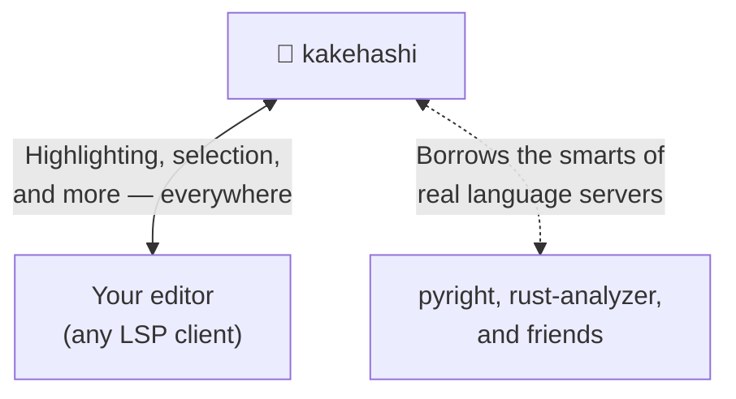

<!-- Focus on providing info for users. Avoid technical details -->

# 🌉 kakehashi (架け橋)

kakehashi is a bridge (架け橋) across your editors, your languages, and the language servers that make them smart.

- bridge to consistent syntax highlighting and smart selection — for any language with a Tree-sitter grammar
- bridge to your language servers' features — configured once in kakehashi, available in any editor
- bridge to all of the above — even for code embedded inside other code



## 🎨 Highlighting & smart selection, for any language

Open a file and kakehashi highlights it — consistently, in every editor. It parses with Tree-sitter, so any language with a grammar just works (that's hundreds of them), and it fetches the grammar it needs automatically the first time you open a file. No manual installs, no config to get started.

The same engine powers **smart selection**: grow or shrink your selection along the code's real structure, not just by lines and words.

Need a niche language, or want highlighting your way? Bring your own Tree-sitter grammar and query files and kakehashi picks them up too — nothing is locked in.

## 🔌 Your language servers, in any editor

The deep features — completions, hover, go-to-definition — come from the real language servers you already trust, like pyright, rust-analyzer, or marksman. kakehashi connects your document to the right one and routes its answers back into your editor.

Best of all, you set them up **once** in kakehashi. Move from Neovim to VS Code to Helix and the same language tooling follows you — no per-editor configuration to redo.

## 🪄 …even for code inside code

You're writing a Markdown README, a Jupyter-style notebook, or an R Markdown report. It's full of embedded code:

````markdown
```python
import pandas as pd
df = pd.read_csv("data.csv")
df.   # ← completions, right here
```
````

kakehashi spots these embedded regions and reaches both bridges right inside them:

- ✨ **Highlighting** that understands each embedded language
- 🧠 **Completions, hover, and go-to-definition** from its language server, inline
- 🎯 **Smart selection** that follows the embedded code's structure

The same trick works anywhere languages nest — SQL in a JavaScript string, CSS and JavaScript in HTML, code blocks in Markdown. A single Markdown file can get marksman for the prose **and** pyright for the Python blocks, all at once.

## Take it for a spin

Want to see kakehashi in action before wiring it into your own setup? Clone the repo and launch a ready-to-go Neovim:

```bash
make deps/nvim
nvim -u scripts/minimal_init.lua
```

Open a Markdown file with a code block and watch the highlighting and completions light up.

## Quick Start

### 1. Install

Download the binary for your platform from [GitHub Releases](https://github.com/atusy/kakehashi/releases) and put it on your `PATH`.

To let kakehashi auto-install the parsers it needs, make sure a **C compiler** is available (`xcode-select --install` on macOS, `build-essential` on Debian/Ubuntu, Build Tools on Windows).

### 2. Wire it into your editor

**Neovim** (built-in LSP, 0.11+):

```lua
vim.lsp.config.kakehashi = {
    cmd = { "kakehashi" },
    init_options = { autoInstall = true },
    on_attach = function(_, bufnr)
        -- Let kakehashi own highlighting (avoids double-highlighting)
        vim.api.nvim_create_autocmd("LspTokenUpdate", {
            buffer = bufnr,
            once = true,
            callback = function()
                vim.opt_local.syntax = "OFF"
                vim.treesitter.stop(bufnr)
            end,
        })
    end,
}
vim.lsp.enable("kakehashi")
```

Open a file and you'll have highlighting and smart selection immediately.

### 3. Bring in the language servers (optional)

Want completions and hover inside your code blocks? Point kakehashi at the language servers you already use — for example pyright for Python or lua-language-server for Lua.

See **[docs/README.md](docs/README.md)** for the full setup: connecting language servers, configuring other editors, the CLI, and every option.

## License

MIT
