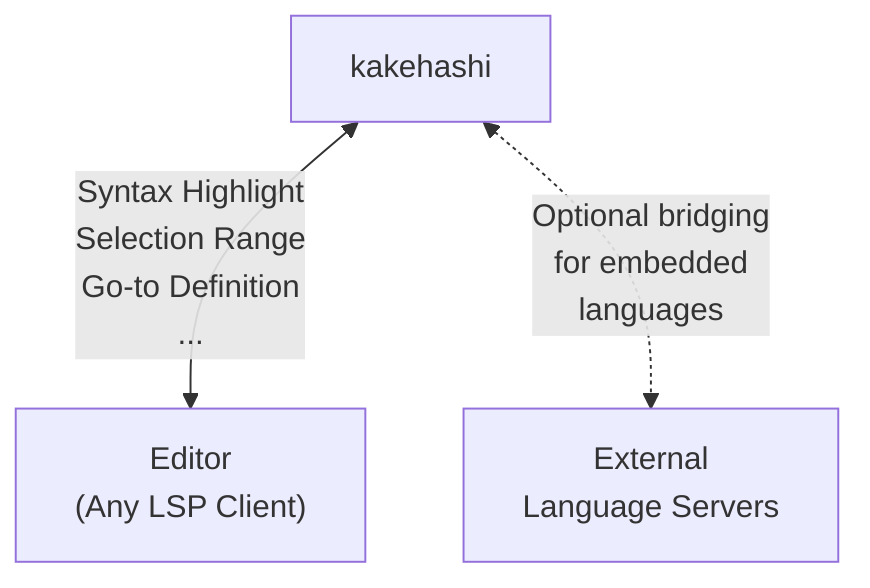

<!-- Focus on providing info for users. Avoid technical details -->

# 🌉 kakehashi (架け橋)

**kakehashi** is a Tree-sitter-based language server that bridges the gap between languages, editors, and tooling.



## What is kakehashi?

kakehashi（架け橋）means "bridge" in Japanese — and that's exactly what this language server does:

### 🌐 Bridge across Languages & Editors

Tree-sitter grammars work everywhere. By leveraging Tree-sitter for parsing, kakehashi provides consistent syntax highlighting, selection ranges, and more across **any editor** that supports LSP and **any language** with a Tree-sitter grammar.

No more fragmented tooling per editor or language.

### 🔗 Bridge for Embedded Languages (Injection)

Markdown with code blocks? HTML with inline JavaScript? kakehashi detects these **injection regions** and can:

1. **Provide Tree-sitter features directly** — semantic tokens and selection ranges work inside embedded code
2. **Delegate to external language servers** — go-to-definition, hover, completion, etc. are forwarded to the appropriate language server (e.g., rust-analyzer for Rust code blocks)

This "virtual file" bridging lets you get full IDE features even inside embedded code.

---

## Features

| Feature | Host | Injection | Bridge |
|---------|:----:|:---------:|:------:|
| Semantic Tokens | ✅ | ✅ | — |
| Selection Range | ✅ | ✅ | — |
| Go-to Definition | — | — | ✅ |
| Go-to Type Definition | — | — | ✅ |
| Go-to Implementation | — | — | ✅ |
| Go-to Declaration | — | — | ✅ |
| Hover | — | — | ✅ |
| Completion | — | — | ✅ |
| Signature Help | — | — | ✅ |
| Find References | — | — | ✅ |

- **Host**: Features for the main document language
- **Injection**: Features for embedded language regions
- **Bridge**: Features delegated to external language servers

---

## Installation

### Pre-built Binaries

Download the latest release for your platform from [GitHub Releases](https://github.com/atusy/kakehashi/releases).

### Enable Automatic Parser/Query Installation

Prepare the following, and kakehashi will auto-install Tree-sitter parsers and queries as needed:

- C compiler
- Git (optional — only needed for non-GitHub parser repositories)

---

## Quick Start

See [docs/README.md](docs/README.md) for detailed setup instructions for various editors.

### Neovim

```bash
make deps/nvim
nvim -u scripts/minimal_init.lua
```

---

## Why kakehashi?

Traditional language servers are language-specific. Tree-sitter parsers are fast and universal, but historically lacked the "smart" features. kakehashi bridges both worlds:

- **Universal parsing** via Tree-sitter
- **Smart features** via LSP bridge to specialized language servers
- **Editor-agnostic** — works with any LSP client

Whether you're editing a Markdown document with embedded Rust, or an HTML file with inline CSS and JavaScript, kakehashi acts as the 架け橋 (bridge) that connects everything together.

---

## License

MIT
